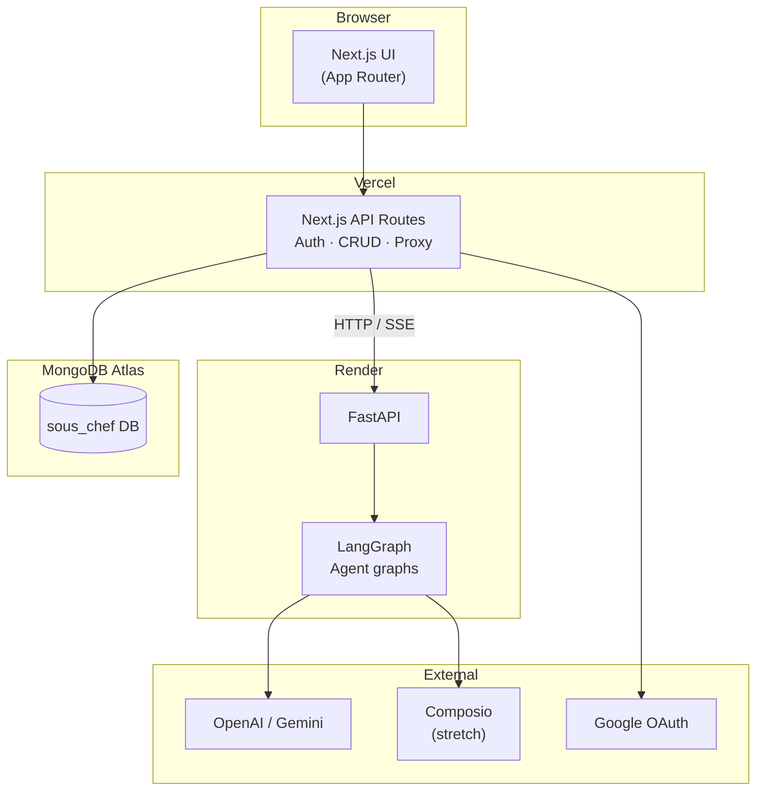
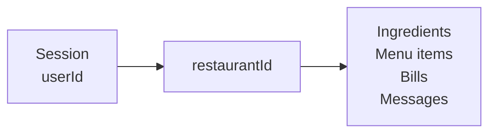
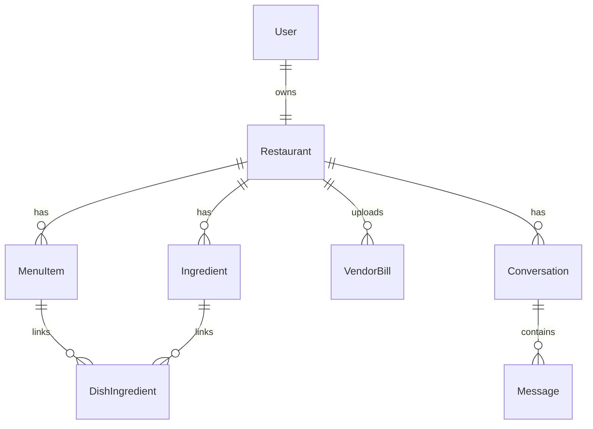
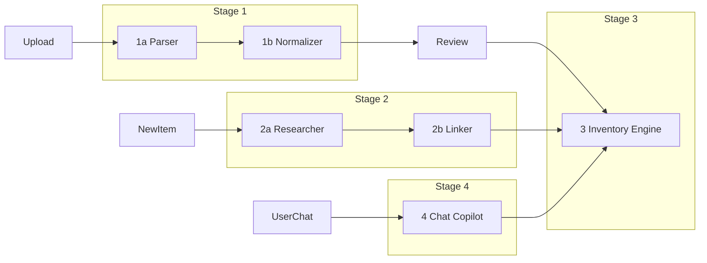

# System architecture

Sous Chef: Next.js web app + MongoDB + Python LangGraph agent service.

## High-level diagram



## Request paths

### Auth & CRUD (Next.js only)

```
Browser → Next.js API → MongoDB
```

Handles: signup, login, restaurant CRUD, conversation list, override saves.

### Bill upload & parse

```
Browser → Next.js API → FastAPI/LangGraph
    → 1a Bill Parser (vision LLM)
    → 1b Item Normalizer
    → return pending lines → Review UI
User confirms → Next.js API → 3 Inventory Engine → MongoDB
```

### Chat

```
Browser → Next.js API → FastAPI/LangGraph
    → 4 Chat Copilot
    → tools call → 3 Inventory Engine (read-only queries)
    → MongoDB
    → SSE stream reply → Browser
```

## Tenancy boundary



- Every API route resolves `restaurantId` from authenticated user.
- Agent service receives `restaurantId` from Next.js — **never** from raw user message text.
- All bill and catalog APIs scope by `restaurantId` from the authenticated session.

## Data model (simplified)



Details: [ingredients.md](../db/ingredients.md), [unit-conversions.md](../db/unit-conversions.md), [sizes.md](../db/sizes.md).

## Agent pipeline



## Inventory depletion flow

```
Sale recorded (receipt or manual)
    → resolve menu item + size (scalePercent)
    → resolve ingredientLinks + add-ons + milk/flavor
    → usageQty per line (kitchen unit)
    → usageToInventoryQty (usageUnits)
    → decrement currentQty
```

Reference implementation: `test/convert-usage.ts`.

## Deployment

| Component | Host | URL pattern |
|-----------|------|-------------|
| Next.js frontend + API | Vercel | `sous-chef.vercel.app` |
| FastAPI + LangGraph | Render free tier | `sous-chef-api.onrender.com` |
| MongoDB | Atlas | Private connection string |

### Environment variables

| Var | Where | Purpose |
|-----|-------|---------|
| `MONGODB_URI` | Vercel, Render | Database |
| `NEXTAUTH_SECRET` | Vercel | Session signing |
| `OPENAI_API_KEY` | Render | LLM + vision |
| `GOOGLE_CLIENT_ID/SECRET` | Vercel | OAuth bonus |
| `AGENT_SERVICE_URL` | Vercel | FastAPI base URL |

## Security notes

- API keys only in server env — never client bundle.
- All chat tools scoped by `restaurantId`.
- Bill files in object storage (S3/R2) or GridFS — not committed to git.

## Related

- [Implementation stages](./stages.md)
- [Tech stack](./stack.md)
- [Agents](../agents/README.md)
