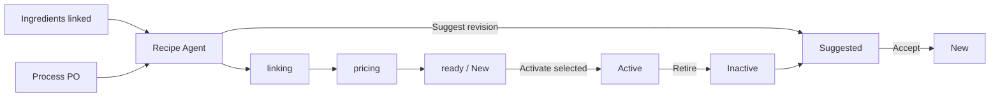

# Recipe workflow

## Status values

| Status | Meaning |
|--------|---------|
| `new` | Recipe Agent linked ingredients; awaiting kitchen approval |
| `active` | Approved for production and costing |
| `inactive` | Retired from menu; recipe kept for history |
| `suggested` | Agent-proposed recipe (may reference **inactive** dishes) |

## Default flow

1. **Link ingredients** — manually in Kitchen Control or via Recipe Agent after PO.
2. **Recipe Agent** — sets `progress: linking`, then `pricing`, then creates a **Recipe** document with `recipeNumber`, `foodCost`, `margin`, and `sellPrice`.
3. **Recipes page** — shows **In progress** rows while linking/pricing; completed recipes appear under **New** (grouped by dish class).
4. **Activate selected** — set `recipeStatus: active` on dish/add-on and Recipe.
5. **Retire** — `active` → `inactive`.

Each recipe stores: recipe number, dish id (slug), dish name, serving qty, ingredients linked `[{ id, name, qty }]`, food cost, margin, and computed sell price.

See [Recipe DB schema](../DB/recipe.md).

## Ingredient labels (pantry)

After linking, `refreshIngredientLabels()` sets:

- `used` — in a recipe and in pantry
- `unused` — in pantry only
- `missing` — in recipe, not in pantry

See [Inventory docs](../Inventory/).

## API

`POST /api/recipes/status` — body `{ items: [{ kind: "dish"|"addon", slug: string }], status: "active"|"inactive"|"suggested" }`.
