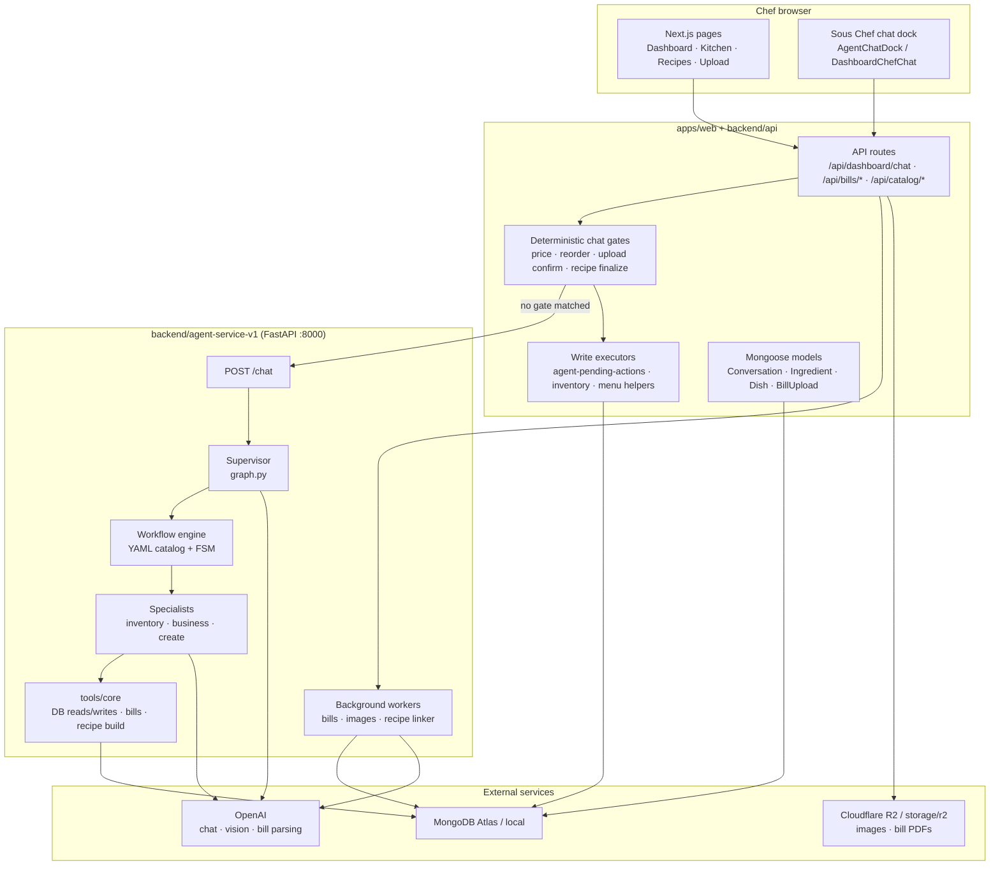
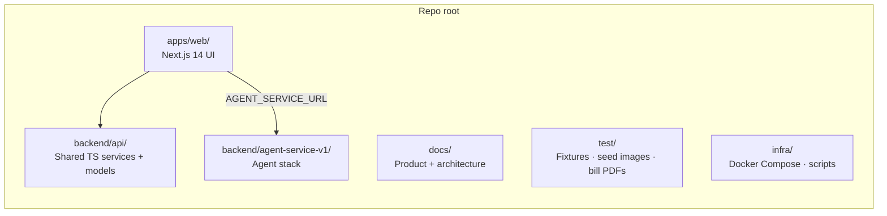
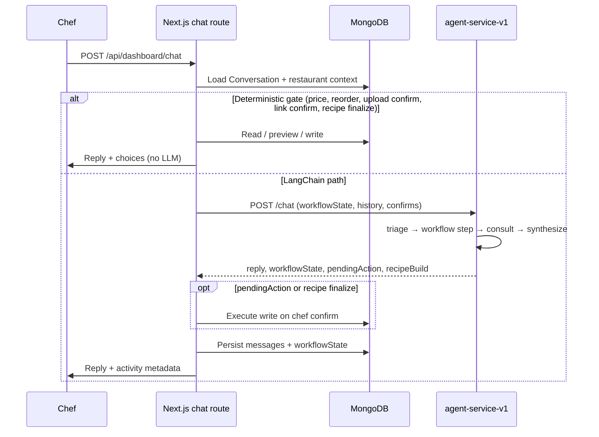
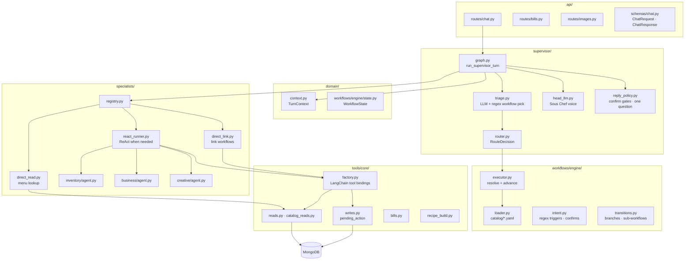
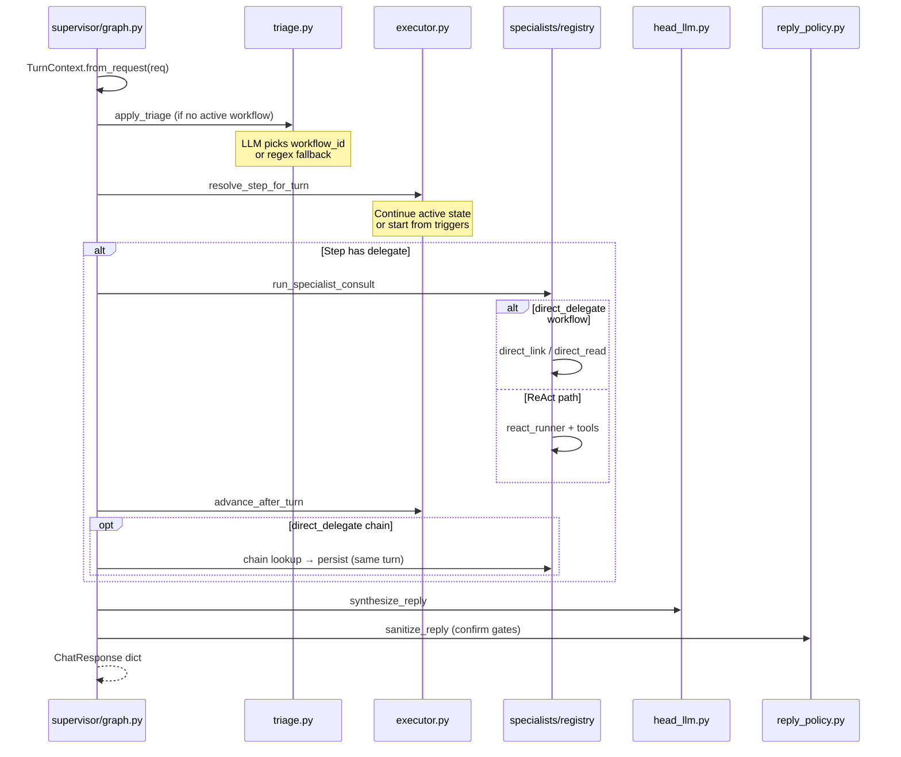
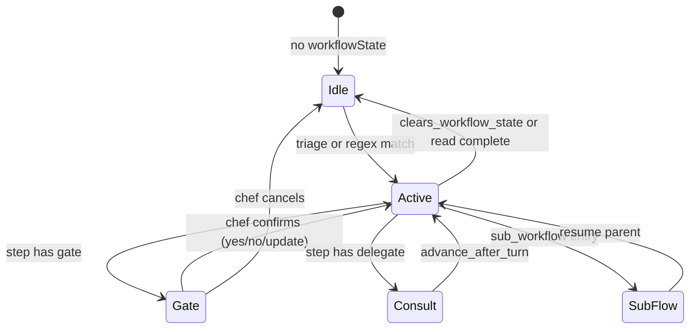
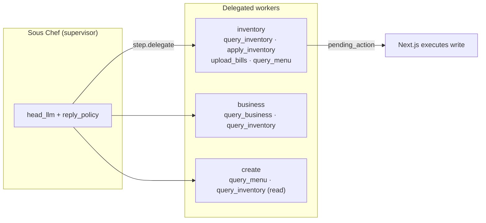
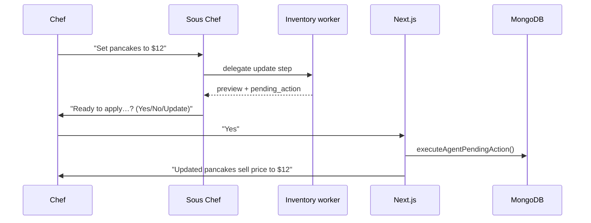
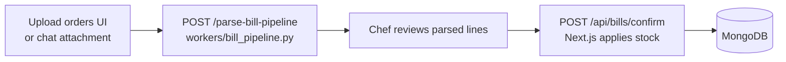
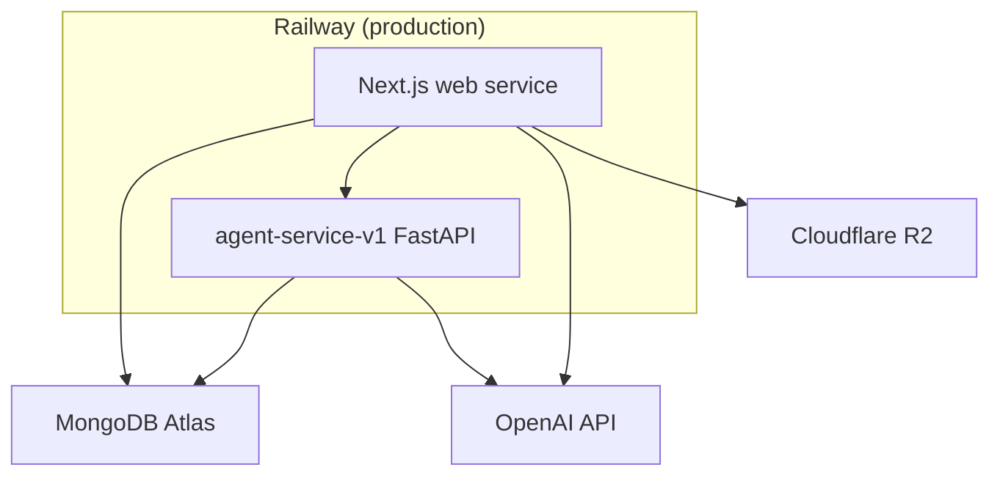

# System Architecture

Detailed architecture diagrams for Sous Chef. For narrative walkthroughs see [How-It-Works.md](./How-It-Works.md).

## Platform overview

Sous Chef is a restaurant operations app: pantry, menu (dishes and add-ons), recipes, bill uploads, and a conversational **Sous Chef** that orchestrates specialist agents. The stack is a **monorepo** with a Next.js web app, shared TypeScript server logic, a Python **agent-service-v1** (primary), and MongoDB as the system of record.



## Repository layout



| Path | Responsibility |
|------|----------------|
| `apps/web/` | Pages, React components, thin API route handlers |
| `backend/api/` | Domain services, Mongoose models, chat intent parsers, agent HTTP client |
| `backend/agent-service-v1/` | **Workflow-first** Python orchestrator — triage, YAML workflows, specialists, tools |
| `docs/` | Architecture, agents, DB schemas, UI notes |
| `test/` | Committed catalog JSON, bill fixtures, seed images |
| `infra/` | MongoDB via Docker Compose, dev start scripts |

## Chat request path (dual path)

Every chef message to Sous Chef goes through **Next.js first**. Structured intents are handled deterministically in TypeScript; everything else is proxied to agent-service-v1.



**Deterministic gates** live in `apps/web/src/app/api/dashboard/chat/route.ts` and `backend/api/services/chat/*`. They exist so common confirms (sell price, reorder level, bill processing, kitchen save) do not depend on LLM reliability.

**Agent path** is used when no gate matches. Next.js calls `callLangChainAgentChat()` in `backend/api/services/agents/agent-chat.ts`, which POSTs to `AGENT_SERVICE_URL/chat` (default `http://localhost:8000`).

## agent-service-v1 internal architecture

agent-service-v1 is the rebuilt agent stack. **YAML workflows are the source of truth** — they are loaded at startup and drive routing, confirm gates, and which specialist runs on each step.



### Layer rules

| Layer | Owns | Must not |
|-------|------|----------|
| `api/` | HTTP validation, serialization | Business logic, LLM calls |
| `workflows/` | Step definitions, gates, delegation targets | Persona wording |
| `supervisor/` | Triage, synthesis, reply policy, Sous Chef tone | Direct DB writes |
| `specialists/` | Worker contracts, ReAct runs, direct tool shortcuts | User-facing confirm copy (supervisor owns that) |
| `tools/` | MongoDB reads/writes, bill pipeline, recipe planning | Chat reply phrasing |
| `prompts/` | System prompt assembly from YAML + markdown specs | Workflow transitions |

## Single chat turn inside agent-service-v1



## Workflow engine (finite state machine)

Workflows are defined in `backend/agent-service-v1/workflows/catalog/*.yaml`. The loader merges all YAML files into one index keyed by `workflow.id`.



**Persisted state** on each `Conversation` document:

```json
{
  "workflowId": "add_dish_from_chat",
  "stepId": "confirm_recipe",
  "lockedName": "Mango Smoothie",
  "gatesPassed": ["confirm_dish_identity"],
  "baggage": {
    "recipe_draft_raw": "...",
    "dish_idea_names": ["A", "B", "C"]
  }
}
```

Next.js and Python share this shape via `backend/api/services/chat/workflow-state.ts` and `workflows/engine/state.py`.

### Workflow catalog (v1)

| Catalog file | Example workflow IDs | Purpose |
|--------------|---------------------|---------|
| `addition-dish.yaml` | `add_dish_from_chat` | Full dish build: ideas → pick → recipe → kitchen save |
| `addition-ingredient.yaml` | `add_ingredient_from_chat` | New pantry ingredient |
| `addition-addon.yaml` | `add_addon_from_chat` | New menu add-on |
| `update-dish.yaml` | `update_dish` | Price, name, status changes |
| `update-ingredient.yaml` | `update_ingredient` | Pantry field updates |
| `update-addon.yaml` | `update_addon` | Add-on metadata |
| `update-link.yaml` | `link_dish_ingredients`, `link_addons_to_dish` | Embedded link flows inside larger updates |
| `update-link-chat.yaml` | `link_*_chat` | **Direct delegate** link flows from a single chat message |
| `query-inventory.yaml` | `inventory_menu_lookup`, `inventory_on_hand` | Menu catalog and stock reads |
| `query-business.yaml` | `business_margin_query`, … | Margins, sales reads |
| `query-creative.yaml` | `suggest_dish_addons`, … | Creative reads |
| `bills.yaml` | `process_bills`, … | PO/SO upload processing |
| `triage.yaml` | (metadata) | Triage hints for LLM classifier |
| `shared.yaml` | — | Shared step fragments |

Executable workflow definitions live in `backend/agent-service-v1/workflows/catalog/`. Historical golden markdown specs are preserved on the `v0` git branch.

## Specialist delegation model

Three **workers** exist — not four chat personas at the Python layer. The Sous Chef supervisor is the only persona-facing layer.



| Specialist | Temperature | Tools (via `tools/registry.py`) | Typical steps |
|------------|-------------|----------------------------------|---------------|
| `inventory` | 0 | Kitchen + pantry + bills + menu apply | Duplicate check, ingredient gaps, persist, link |
| `business` | 0 | Business analytics + pantry read | Margin pass after dish build |
| `create` | 0 | Menu + pantry read | Dish ideas, recipe draft, visual brief |

**Direct paths** (no ReAct loop) for predictable operations:

- `specialists/direct_read.py` — `mode: read` workflows (menu catalog lookup, add-on list)
- `specialists/direct_link.py` — `direct_delegate: true` link workflows (addon→dish, ingredient links)

## Write confirmation flow

Agents never silently write to production collections. Writes surface as `pending_action` or `recipe_build` for Next.js to execute after the chef confirms.



The same helpers power **manual UI** (Kitchen control, Upload orders) and **chat** — chat is an alternate front door, not a separate data path.

## Bill and image pipelines



Image suggestions for new dishes flow through `POST /suggest-images` (`workers/image_suggestions.py`). Recipe linking uses `POST /link-recipe`.

Process **purchase orders before sales orders** so dish recipes resolve against pantry stock.

## Deployment topology



| Variable | Used by | Purpose |
|----------|---------|---------|
| `MONGODB_URI` | Web + agent | Database connection |
| `AGENT_SERVICE_URL` | Web | Points to v1 FastAPI (`/chat`) |
| `OPENAI_API_KEY` | Agent + some Next routes | LLM + vision |
| `USE_LANGCHAIN_AGENTS` | Web chat route | `false` disables agent proxy |
| `R2_STORAGE_ROOT` | Web | Local or R2 image/bill storage |

Local dev: `npm run dev:agent` (port 8000) + `npm run dev:web` (port 3000) + `npm run docker:up` (MongoDB).

## Related docs

- [How-It-Works.md](./How-It-Works.md) — end-to-end narrative, especially agent-service-v1
- [Architecture.md](./Architecture.md) — shorter overview
- [Agents.md](./Agents.md) — chat agents and tool matrix
- [backend/agent-service-v1/ARCHITECTURE.md](../backend/agent-service-v1/ARCHITECTURE.md) — v1 module-level notes
- [backend/agent-service-v1/workflows/README.md](../backend/agent-service-v1/workflows/README.md) — YAML catalog reference
